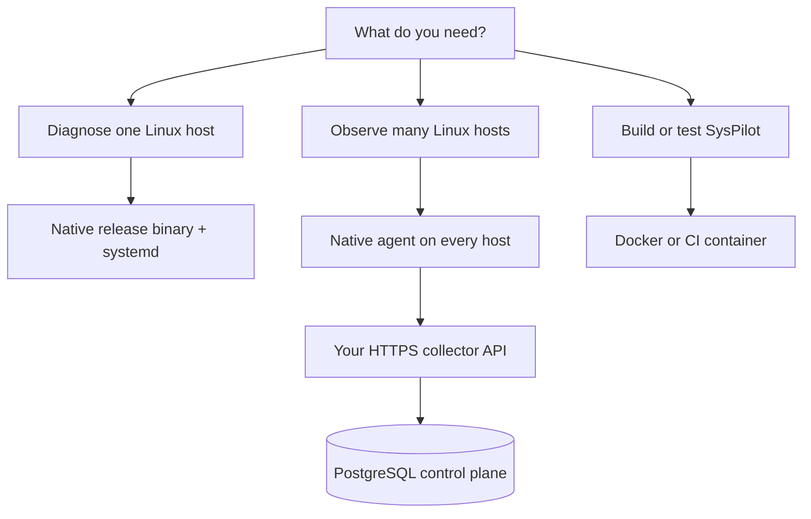
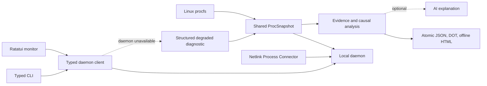
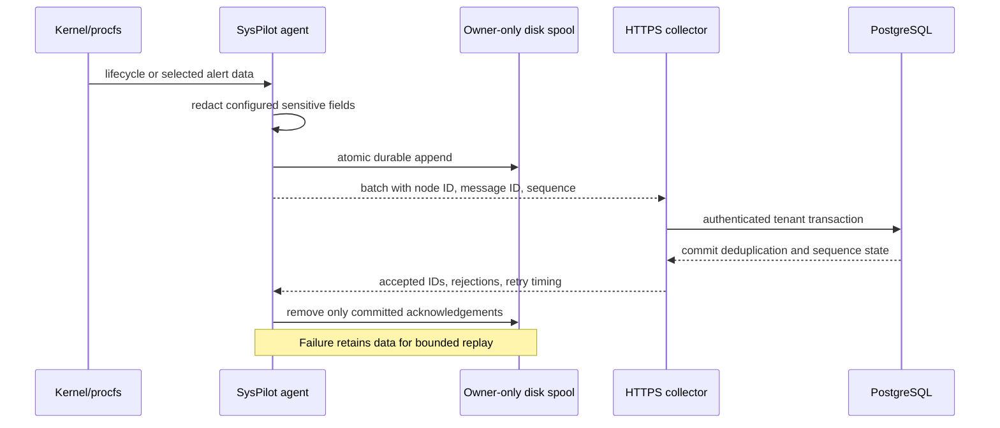
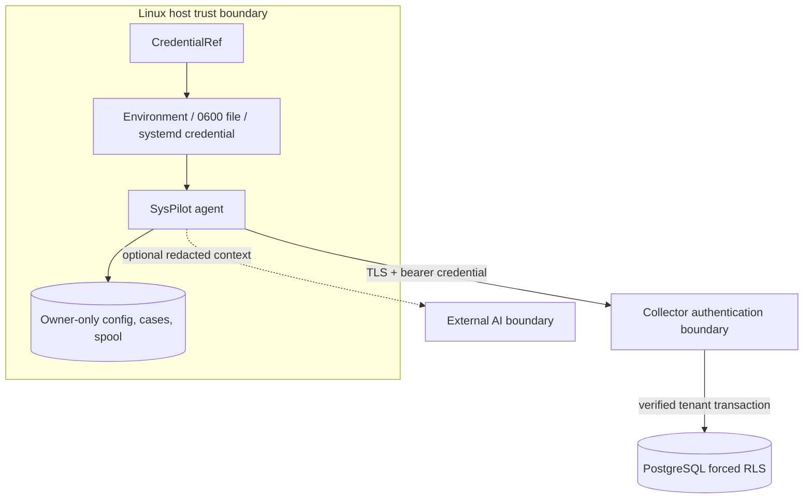
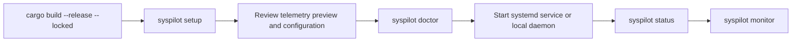

# SysPilot Architecture

This document describes the current Rust implementation. For setup, operation, distributed telemetry, alert rules, and troubleshooting, use the [project README](README.md). The [documentation index](docs/README.md) identifies historical material that does not describe the active system.

## Choose a deployment



Use the native binary for host diagnostics. Containers are appropriate for builds, tests, and the future collector API, but a containerized agent needs host PID visibility and elevated capabilities and therefore has a weaker security boundary.

## Local runtime flow



AI, fleet connectivity, and PostgreSQL are never required for local diagnostics. When the daemon is unavailable, supported commands identify the cause, impact, procfs fallback, and recovery command instead of silently changing behavior.

## Components and responsibilities

| Component | Responsibility |
|---|---|
| `src/cli.rs`, `src/main.rs` | Typed command grammar, bounded command handling, RCA-context construction, and user-visible errors. |
| `src/config.rs`, `src/credentials.rs` | Schema-v2 configuration, validation, atomic persistence, and runtime credential resolution without serialized secret values. |
| `src/daemon.rs` | Initial procfs scan, Netlink lifecycle events, local UNIX socket service, and configured alert evaluation. |
| `src/distributed.rs` | Versioned envelopes, bounded queue, batching, retry policy, HTTP delivery, and exact/prefix process-name matching. |
| `src/telemetry.rs`, `src/proc_snapshot.rs` | Linux procfs/system data and shared bounded-age process snapshots. |
| `src/causal_engine.rs` | Graph construction, reverse causal traversal, and graph exports. |
| `src/ai.rs` | Gemini, Ollama, and SysPilot API streaming requests with provider failure handling. |
| `src/codebase.rs` | Local source chunking and codebase index/query support. |
| `src/profiler.rs` | Optional process profiling data. |
| `src/ui/` | Terminal monitor and Markdown stream renderer. |
| `crates/syspilot-abi` | Shared telemetry ABI types. |
| `crates/syspilot-collector` | Bounded collector primitives and fleet database schema invariants. |
| `deploy/fleet/` | PostgreSQL fleet-control migration and fail-closed setup tooling. |

## Distributed telemetry boundary

The daemon persists redacted `process_lifecycle` and configured `process_alert` envelopes before asynchronous HTTP delivery, so collector latency never blocks the Netlink loop. Acknowledged records leave the spool; failures remain durable for replay. Collectors use `node_id`, `message_id`, and monotonic `sequence` to deduplicate deliveries and report gaps.

The optional fleet database exists only behind the collector/control-plane API. Agents never receive database credentials or issue SQL. PostgreSQL row-level security provides defense in depth, but request authorization must still derive and set the verified tenant inside every transaction. See [Fleet control-plane database](docs/FLEET_CONTROL_PLANE.md).

The collector endpoint, authentication token, node ID, attributes, batch size, queue capacity, retry policy, and alert rules are configuration, not source-code deployment values. See [Distributed telemetry and alerts](README.md#distributed-telemetry-and-alerts).



### Current scale boundary

There is no defensible fixed “number of servers” rating yet. Every host runs one independent exporter worker with a default batch of 256 records per second, a 4,096-entry wake-up queue, and an owner-only spool bounded to 512 MiB or seven days. Those are per-agent resilience limits, not collector capacity figures.

The repository currently provides the agent protocol, acknowledgement validation, retry/replay behavior, and tenant-isolated PostgreSQL schema. It does **not** yet provide a production HTTP ingestion service, horizontal autoscaling implementation, or fleet load-test result. Until those exist, SysPilot supports local agents and development collector integrations, but no production fleet-size claim should be made. Collector capacity will depend on request rate per node, database transaction latency, connection-pool sizing, retention, and replication.

## Security boundaries



- Configuration, JSON output, logs, doctor reports, and support bundles expose credential source and availability, never credential values.
- Hosted enrollment requires HTTPS. Self-hosted plain HTTP is an explicit local-development choice and should not cross an untrusted network.
- Redaction happens before telemetry is spooled or transmitted.
- Delivery is replay-safe and acknowledgement-driven, but it is not exactly-once transport; collectors must deduplicate by tenant, node, and message ID.
- Forced database row-level security is defense in depth. The collector must authenticate the node and set the tenant inside every transaction.
- No telemetry is exported until an operator enables it and can inspect a preview.

## First-run path



## RCA data boundary

RCA starts with data collected by the selected command path: procfs telemetry, optional graph evidence, optional profiler or eBPF data, codebase context, and configured alert/event context when available. AI output is requested to distinguish evidence from inference and report confidence. It is not a substitute for validating changes in the target environment.

## Build and verification

```bash
cargo build --release --locked
cargo fmt --all -- --check
cargo clippy --locked --workspace --all-targets -- -D warnings
cargo test --locked --workspace --all-targets
```

Use `cargo build --release` to create the release binary at `target/release/syspilot`.

## Security and permissions

SysPilot uses normal Linux process permissions. Data for protected processes can be absent. Optional tracing and profiling require their own tools and permissions. Treat external AI prompts and telemetry collector payloads as data leaving the host; configure them according to your security policy.
