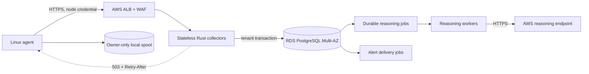

# Cloud operations

SysPilot keeps collection, redaction, and durable buffering on each Linux host.
The cloud accepts only explicitly enabled exports. AWS performs fleet reasoning
and alert delivery on committed redacted envelopes; an AWS outage never disables
local diagnostics.

## Services



`syspilot-cloud` is the public ingestion service. It has no AI or notification
credentials. `syspilot-reasoning-worker` has execute access only to guarded job
functions and calls the configured AWS reasoning endpoint. Database migrations
run under a separate administrator and never under either runtime identity.

## Required secrets

Create a Kubernetes secret named `syspilot-cloud-runtime` through External
Secrets or another AWS Secrets Manager integration. It must contain:

| Key | Consumer | Contract |
|---|---|---|
| `collector-database-url` | Collector | TLS-enforced PostgreSQL login in `syspilot_control_app`. |
| `credential-pepper` | Collector | Random value of at least 32 bytes, rotated through an overlap procedure. |
| `reasoning-database-url` | Worker | TLS-enforced login only in `syspilot_cloud_worker`. |
| `reasoning-token` | Worker | Credential for the HTTPS AWS reasoning endpoint. |
| `notification-database-url` | Notification worker | TLS-enforced login only in `syspilot_notification_worker`. |
| `notification-token` | Notification worker | Credential for the HTTPS AWS SES/webhook delivery endpoint. |

Never place these values in Helm values, images, Git, logs, support bundles, or
application error responses.

## Deployment

Apply database migrations from an isolated migration job, then install the
chart with an immutable image digest and the AWS endpoint:

```bash
helm upgrade --install syspilot deploy/cloud/helm/syspilot \
  --namespace syspilot --create-namespace \
  --set image.repository=ACCOUNT.dkr.ecr.REGION.amazonaws.com/syspilot-cloud \
  --set image.digest=sha256:RELEASE_IMAGE_DIGEST \
  --set reasoning.endpoint=https://REASONING_HOST/v1/analyze \
  --set notification.endpoint=https://NOTIFICATION_HOST/v1/deliver
```

Production rendering fails unless `image.digest` is a lowercase SHA-256 digest. `image.tag` is accepted only with `image.allowMutableTagForLocalDevelopment=true`; that override is for isolated local development.

Terminate public TLS at ALB using ACM, restrict ingress with WAF, and permit
database traffic only from collector and worker security groups. The chart does
not create secrets, public ingress, RDS, or IAM resources implicitly.

## Health and scaling

- `/health/live` proves the collector process is responsive.
- `/health/ready` proves PostgreSQL is reachable; remove the pod from service
  when it fails.
- `/metrics` currently returns bounded counters as JSON. Restrict it to the
  monitoring network; it is not a public customer API.
- Collector replicas are stateless. HPA targets 70% CPU and scales from two to
  twenty replicas by default.
- Reasoning workers use `FOR UPDATE SKIP LOCKED`; replicas can increase without
  leasing the same job concurrently.
- Notification workers independently lease email/webhook deliveries and use
  bounded retries; the AWS endpoint performs SES or outbound webhook delivery.
- Credential-bearing workers refuse redirects. Timeouts, 429s, 5xx replies,
  malformed reasoning results, and transport failures enter bounded retry;
  repeated provider failure opens a short local circuit without deleting jobs.
- Worker crashes recover through lease expiry. Query
  `syspilot_control.worker_delivery_health` for queue age, expired leases, and
  permanently failed deliveries.
- Collector saturation returns `503` and `Retry-After`. Agents retain records
  in their local spool and retry with jitter.

## Release and incident gates

Do not claim a supported fleet maximum from the synthetic benchmark. Production
certification must use the real collector, RDS, RLS, workers, retention, and
replay. Alert on authentication failures, rejected sequences, database errors,
admission saturation, old pending jobs, exhausted retries, notification backlog,
and agent spool age.

If reasoning is impaired, keep ingestion available and expose reasoning delay.
If PostgreSQL cannot commit, acknowledge nothing. If tenant identity cannot be
proven, reject the request. Restore from encrypted backups in a separate account
and regularly prove tenant isolation after restoration.
