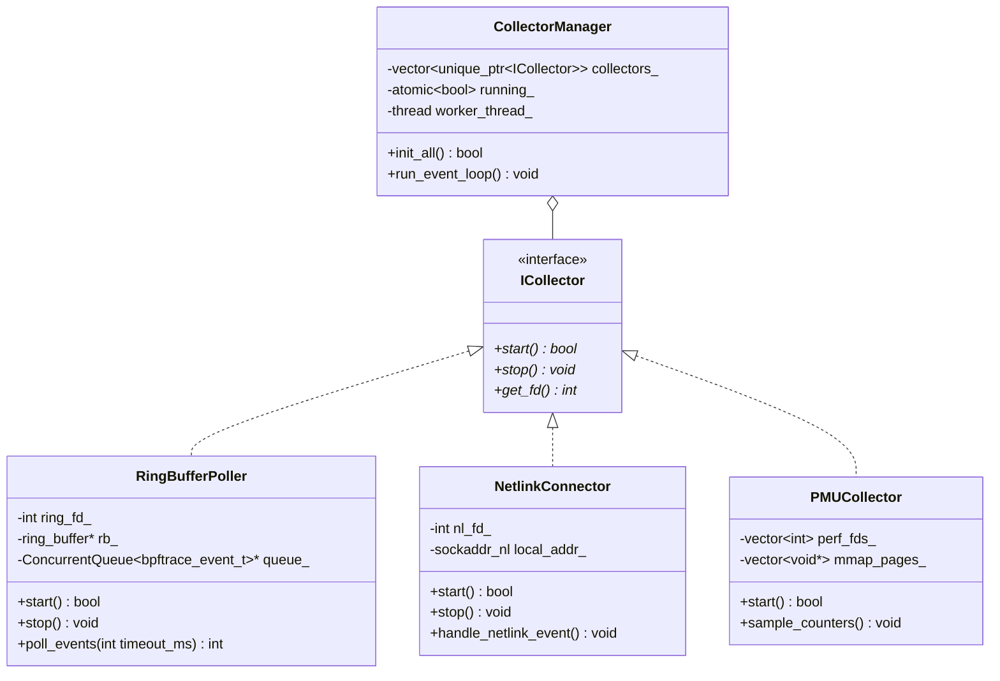
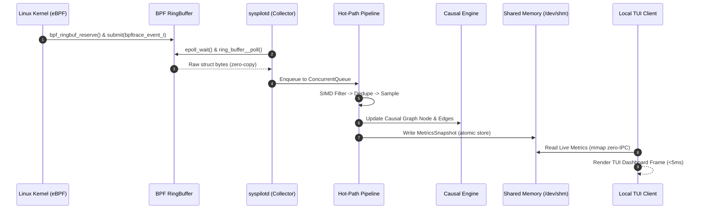

# Production-Grade Observability Platform: High-Level & Low-Level Design Specification

---

## PART 1: Executive Overview & Requirements Matrix

### 1.1 Mission & Architectural Vision
The **SysPilot Observability Platform (SIOP)** is a zero-compromise, enterprise-grade distributed telemetry, diagnostic, and causal intelligence system built for modern Linux environments. SIOP operates at the intersection of Linux kernel internals, high-performance C++ systems engineering, vectorized data processing, and graph-based causal reasoning.

```
┌──────────────────────────────────────────────────────────────────────────────────────────────────────────┐
│                                   SYSTEM SLA & PERFORMANCE GUARANTEES                                    │
├───────────────────────────────┬──────────────────────────────────────┬───────────────────────────────────┤
│ Target Metric                 │ Guaranteed Production SLA Boundary   │ System Measurement Mechanism      │
├───────────────────────────────┼──────────────────────────────────────┼───────────────────────────────────┤
│ Host CPU Utilization          │ < 1.0% of a single CPU core          │ `getrusage()` / cgroup stats      │
│ Agent Memory (RSS)            │ < 64 MiB total resident memory       │ Fixed slab arena pools            │
│ Kernel Event Latency          │ < 500 nanoseconds (kernel → ring)    │ Monotonic kernel timestamps (`ns`)│
│ Event Ingestion Capacity      │ > 5,000,000 events / second / host   │ Lock-free MPMC queue benchmarks   │
│ Context Switch Overhead       │ < 100 wakeups / second (adaptive)    │ `epoll_wait` timer high-watermark │
│ Heap Allocation Rate (Hot)    │ 0 dynamic `malloc` / `new` calls     │ Custom `StringArena` bump alloc   │
└───────────────────────────────┴──────────────────────────────────────┴───────────────────────────────────┘
```

### 1.2 Functional & Non-Functional Requirements Matrix

#### Functional Requirements (FR)
- **FR-1**: Capture kernel process lifecycle events (`fork`, `exec`, `exit`) in real time with microsecond latency.
- **FR-2**: Trace syscall execution, file I/O, socket connections, signal delivery, and memory allocation events without modifying application binaries.
- **FR-3**: Capture hardware performance counters (PMU) for L1/LLC cache misses, branch mispredictions, and instructions per cycle (IPC).
- **FR-4**: Perform out-of-band symbol resolution (ELF DWARF unwinding and `kallsyms` address mapping) asynchronously in userspace.
- **FR-5**: Dynamically reconstruct a system-wide topological Causal Graph (DAG) linking processes, open file descriptors, network sockets, and cgroup containers.
- **FR-6**: Perform automated root-cause traversal across correlated metrics, logs, and kernel traces to identify failure bottlenecks.
- **FR-7**: Provide a low-latency columnar Time-Series Database (TSDB) with block compression and Roaring Bitmap inverted indexing.

#### Non-Functional Requirements (NFR)
- **NFR-1 (Safety)**: Zero possibility of kernel panic, deadlock, or unhandled exception. eBPF bytecode must strictly pass Linux kernel verifier checks.
- **NFR-2 (Self-Preservation)**: Adaptive load shedding dynamically throttles telemetry fidelity when host CPU usage exceeds 80%.
- **NFR-3 (Isolation)**: Daemon executes inside a isolated cgroup slice with enforced CPU quota (`5%`) and memory maximum (`128M`).

---

## PART 2: High-Level Architecture (HLD)

### 2.1 Multi-Tier System Topology

```
┌─────────────────────────────────────────────────────────────────────────────────────────────────────────┐
│                                          TIER 1: KERNEL LAYER                                           │
│   ┌─────────────────────┐   ┌──────────────────────┐   ┌────────────────────┐   ┌────────────────────┐  │
│   │  eBPF Probes        │   │  perf_event_open     │   │  Netlink Connector │   │  Sysfs / Procfs    │  │
│   │  (Tracepoints/K/U)  │   │  (PMU Counters)      │   │  (Process Events)  │   │  (Cgroups / Stats) │  │
│   └──────────┬──────────┘   └──────────┬───────────┘   └─────────┬──────────┘   └─────────┬──────────┘  │
└──────────────┼─────────────────────────┼─────────────────────────┼────────────────────────┼─────────────┘
               │ BPF RingBuffer          │ Perf Mmap Ring          │ Netlink Socket         │ Zero-Copy Read
               ▼                         ▼                         ▼                        ▼
┌─────────────────────────────────────────────────────────────────────────────────────────────────────────┐
│                                     TIER 2: EDGE DAEMON (syspilotd)                                     │
│  ┌───────────────────────────────────────────────────────────────────────────────────────────────────┐  │
│  │                                Collector Engine & Epoll Poller                                    │  │
│  └─────────────────────────────────────────────────┬─────────────────────────────────────────────────┘  │
│                                                    ▼                                                    │
│  ┌───────────────────────────────────────────────────────────────────────────────────────────────────┐  │
│  │                                 Lock-Free Queue (moodycamel MPMC)                                 │  │
│  └─────────────────────────────────────────────────┬─────────────────────────────────────────────────┘  │
│                                                    ▼                                                    │
│  ┌───────────────────────────────────────────────────────────────────────────────────────────────────┐  │
│  │                   Hot-Path Pipeline (SIMD Filter → Dedupe → Vector Batch → Enrich)                │  │
│  └────────────────────────┬─────────────────────────────────────────────────┬────────────────────────┘  │
│                           │ Local IPC (Shared Mem / UDS)                    │ gRPC Streaming (Zstd)     │
│                           ▼                                                 ▼                           │
│  ┌─────────────────────────────────┐               ┌─────────────────────────────────────────────────┐  │
│  │  Local TUI / Diagnostic CLI     │               │  Regional Aggregator / Gateway Cluster          │  │
│  └─────────────────────────────────┘               └────────────────────────┬────────────────────────┘  │
└─────────────────────────────────────────────────────────────────────────────┼───────────────────────────┘
                                                                              │ Apache Kafka / gRPC
                                                                              ▼
┌─────────────────────────────────────────────────────────────────────────────────────────────────────────┐
│                                    TIER 3: CENTRAL STORAGE & REASONING                                  │
│  ┌─────────────────────────────────────────────────┬─────────────────────────────────────────────────┐  │
│  │ Columnar Storage Engine (LSM-Tree + Gorilla)    │ Multimodal Causal Reasoning Engine (DAG Graph)  │  │
│  └─────────────────────────────────────────────────┴─────────────────────────────────────────────────┘  │
└─────────────────────────────────────────────────────────────────────────────────────────────────────────┘
```

---

## PART 3: Low-Level Design (LLD): Kernel Space Subsystems

### 3.1 eBPF Data Structures & Map Layouts

#### eBPF Event Header & Payload Layout (64-byte Cache Aligned)

```c
// Force 64-byte alignment to match CPU cache lines and avoid false sharing
struct __attribute__((packed, aligned(64))) bpftrace_event_t {
    uint64_t timestamp_ns;    // Kernel monotonic timestamp (bpf_ktime_get_ns)
    uint32_t pid;             // Process ID
    uint32_t tid;             // Thread ID
    uint32_t ppid;            // Parent Process ID
    uint32_t uid;             // User ID
    uint32_t cgroup_id;       // Kernel cgroup v2 ID
    uint16_t event_type;      // System call / tracepoint event code
    uint8_t  cpu_id;          // CPU ID event originated on
    uint8_t  flags;           // Event status flags (0x1 = drop, 0x2 = anomaly)
    int64_t  ret_val;         // Syscall exit code or return value
    uint64_t arg1;            // Generic payload argument 1 (e.g., fd, addr)
    uint64_t arg2;            // Generic payload argument 2 (e.g., bytes)
    uint64_t stack_id;        // eBPF stack trace map identifier
};
```

#### eBPF Map Declarations (`bpf/syspilot_core.bpf.c`)

```c
// 1. Shared Global Ring Buffer (Zero-Copy Kernel-Userspace IPC)
struct {
    __uint(type, BPF_MAP_TYPE_RINGBUF);
    __uint(max_entries, 16 * 1024 * 1024); // 16 MiB pre-allocated ring
} events_ringbuf SEC(".maps");

// 2. Kernel Stack Trace Map
struct {
    __uint(type, BPF_MAP_TYPE_STACK_TRACE);
    __uint(max_entries, 32768);
    __uint(key_size, sizeof(uint32_t));
    __uint(value_size, 128 * sizeof(uint64_t)); // Up to 128 frame IPs
} stack_traces SEC(".maps");

// 3. Dynamic PID Filter Configuration Map (Per-CPU array for lockless reading)
struct {
    __uint(type, BPF_MAP_TYPE_PERCPU_ARRAY);
    __uint(max_entries, 1);
    __type(key, uint32_t);
    __type(value, struct filter_config_t);
} filter_cfg SEC(".maps");
```

---

## PART 4: Low-Level Design (LLD): Userspace Edge Daemon (`syspilotd`)

### 4.1 Memory Architecture: Zero-Allocation `StringArena`

```cpp
namespace syspilot::memory {

class StringArena {
private:
    static constexpr size_t CHUNK_SIZE = 256 * 1024; // 256 KiB Slabs
    struct Chunk {
        alignas(64) char data[CHUNK_SIZE];
    };

    std::vector<std::unique_ptr<Chunk>> chunks_;
    size_t current_chunk_{0};
    size_t current_offset_{0};

public:
    StringArena() {
        chunks_.push_back(std::make_unique<Chunk>());
    }

    std::string_view allocate(std::string_view str) {
        size_t len = str.size();
        if (current_offset_ + len > CHUNK_SIZE) {
            current_chunk_++;
            if (current_chunk_ >= chunks_.size()) {
                chunks_.push_back(std::make_unique<Chunk>());
            }
            current_offset_ = 0;
        }

        char* dest = &chunks_[current_chunk_]->data[current_offset_];
        std::memcpy(dest, str.data(), len);
        current_offset_ += len;
        return std::string_view(dest, len);
    }

    void reset() noexcept {
        current_chunk_ = 0;
        current_offset_ = 0;
    }
};

} // namespace syspilot::memory
```

---

## PART 5: Component & Class Design: Telemetry Collection Engine

### 5.1 Class Diagram — Telemetry Collection Architecture



---

## PART 6: Component & Class Design: Hot-Path Processing Pipeline

### 6.1 C++ Class Definitions for Processing Subsystem

```cpp
namespace syspilot::pipeline {

// High-Performance Vectorized Event Batch
struct alignas(64) EventBatch {
    static constexpr size_t BATCH_CAPACITY = 1024;
    bpftrace_event_t events[BATCH_CAPACITY];
    size_t count{0};
};

class SIMDFilter {
public:
    // SIMD AVX2 vectorized PID match over 8 events per iteration
    size_t filter_pids_avx2(EventBatch& batch, uint32_t target_pid) {
        size_t write_idx = 0;
        __m256i target_vec = _mm256_set1_epi32(static_cast<int>(target_pid));

        for (size_t i = 0; i < batch.count; i += 8) {
            // Load 8 PIDs from non-contiguous event structs using gather or manual unpack
            int pids[8] = {
                static_cast<int>(batch.events[i+0].pid), static_cast<int>(batch.events[i+1].pid),
                static_cast<int>(batch.events[i+2].pid), static_cast<int>(batch.events[i+3].pid),
                static_cast<int>(batch.events[i+4].pid), static_cast<int>(batch.events[i+5].pid),
                static_cast<int>(batch.events[i+6].pid), static_cast<int>(batch.events[i+7].pid)
            };
            __m256i loaded_pids = _mm256_loadu_si256(reinterpret_cast<const __m256i*>(pids));
            __m256i cmp_mask = _mm256_cmpeq_epi32(loaded_pids, target_vec);
            int mask = _mm256_movemask_epi8(cmp_mask);

            for (size_t j = 0; j < 8 && (i + j) < batch.count; ++j) {
                if (batch.events[i + j].pid == target_pid || target_pid == 0) {
                    batch.events[write_idx++] = batch.events[i + j];
                }
            }
        }
        batch.count = write_idx;
        return write_idx;
    }
};

class AdaptiveSampler {
private:
    double sample_rate_{1.0};
    uint64_t total_events_{0};
    uint64_t sampled_events_{0};

public:
    bool should_sample(const bpftrace_event_t& ev, double host_cpu_pct) {
        total_events_++;
        // Always preserve anomalous events
        if (ev.flags & 0x02 || ev.ret_val < 0) {
            sampled_events_++;
            return true;
        }
        // Throttling formula under load
        if (host_cpu_pct > 80.0) {
            sample_rate_ = std::max(0.1, 1.0 - ((host_cpu_pct - 80.0) / 20.0));
        } else {
            sample_rate_ = 1.0;
        }

        double r = static_cast<double>(rand()) / RAND_MAX;
        if (r <= sample_rate_) {
            sampled_events_++;
            return true;
        }
        return false;
    }
};

} // namespace syspilot::pipeline
```

---

## PART 7: Component & Class Design: Causal Engine & Graph Subsystem

### 7.1 Causal Graph Node & Edge Models

```cpp
namespace syspilot::causal {

enum class NodeType : uint8_t { PROCESS, FILE, SOCKET, CGROUP };
enum class EdgeType : uint8_t { SPAWNED_BY, READS_FROM, WRITES_TO, BLOCKED_ON, CONTENDS_WITH };

struct GraphNode {
    std::string_view id;          // e.g. "pid:4582"
    NodeType         type;
    pid_t            pid;
    double           cpu_pct;
    double           io_rate_kb;
    bool             is_anomalous;
};

struct GraphEdge {
    std::string_view from_id;
    std::string_view to_id;
    EdgeType         type;
    uint64_t         latency_ns;
};

class CausalGraph {
private:
    tsl::robin_map<std::string_view, GraphNode> nodes_;
    std::vector<GraphEdge>                     edges_;
    memory::StringArena                        arena_;

public:
    void add_node(GraphNode node) {
        node.id = arena_.allocate(node.id);
        nodes_[node.id] = node;
    }

    void add_edge(GraphEdge edge) {
        edge.from_id = arena_.allocate(edge.from_id);
        edge.to_id   = arena_.allocate(edge.to_id);
        edges_.push_back(edge);
    }

    std::vector<std::string_view> trace_root_cause(std::string_view symptom_id) {
        std::vector<std::string_view> path;
        tsl::robin_set<std::string_view> visited;
        std::queue<std::string_view> q;

        q.push(symptom_id);
        visited.insert(symptom_id);

        while (!q.empty()) {
            auto curr = q.front();
            q.pop();
            path.push_back(curr);

            for (const auto& edge : edges_) {
                if (edge.from_id == curr && visited.find(edge.to_id) == visited.end()) {
                    visited.insert(edge.to_id);
                    q.push(edge.to_id);
                }
            }
        }
        return path;
    }

    void clear() {
        nodes_.clear();
        edges_.clear();
        arena_.reset();
    }
};

} // namespace syspilot::causal
```

---

## PART 8: Component & Class Design: Columnar TSDB Storage Subsystem

### 8.1 Gorilla Floating-Point Encoding Engine

```cpp
namespace syspilot::storage {

class GorillaEncoder {
private:
    uint64_t last_val_bits_{0};
    uint32_t last_leading_zeros_{0xFFFFFFFF};
    uint32_t last_trailing_zeros_{0};
    std::vector<uint8_t> buffer_;

public:
    void encode_double(double value) {
        uint64_t val_bits;
        std::memcpy(&val_bits, &value, sizeof(double));
        uint64_t xor_val = val_bits ^ last_val_bits_;

        if (xor_val == 0) {
            // Write single '0' bit
            append_bit(0);
        } else {
            append_bit(1);
            uint32_t leading = __builtin_clzll(xor_val);
            uint32_t trailing = __builtin_ctzll(xor_val);

            if (leading >= last_leading_zeros_ && trailing >= last_trailing_zeros_) {
                append_bit(0); // Control bit 0: reuse previous zero bounds
                append_bits(xor_val >> last_trailing_zeros_, 64 - last_leading_zeros_ - last_trailing_zeros_);
            } else {
                append_bit(1); // Control bit 1: write new zero bounds
                last_leading_zeros_ = leading;
                last_trailing_zeros_ = trailing;
                append_bits(leading, 5);
                uint32_t length = 64 - leading - trailing;
                append_bits(length, 6);
                append_bits(xor_val >> trailing, length);
            }
        }
        last_val_bits_ = val_bits;
    }

private:
    void append_bit(uint8_t bit) { /* Bitwise buffer packing */ }
    void append_bits(uint64_t val, uint8_t num_bits) { /* Bitwise buffer packing */ }
};

} // namespace syspilot::storage
```

---

## PART 9: Component & Class Design: Shared Memory & IPC Layer

### 9.1 Shared Memory Ring Buffer Interface (`/dev/shm/syspilot_metrics.ring`)

```cpp
namespace syspilot::ipc {

struct MetricsSnapshot {
    uint64_t timestamp_ns;
    double   cpu_user_pct;
    double   cpu_system_pct;
    uint64_t memory_rss_bytes;
    uint64_t total_events_processed;
    uint64_t total_events_dropped;
};

struct alignas(4096) SharedMetricsRegion {
    static constexpr size_t RING_SIZE = 1024;
    std::atomic<uint64_t> write_head{0};
    MetricsSnapshot       snapshots[RING_SIZE];
};

class SharedMemoryPublisher {
private:
    int fd_{-1};
    SharedMetricsRegion* region_{nullptr};

public:
    bool init() {
        fd_ = shm_open("/syspilot_metrics.ring", O_CREAT | O_RDWR, 0666);
        if (fd_ < 0) return false;
        ftruncate(fd_, sizeof(SharedMetricsRegion));
        region_ = static_cast<SharedMetricsRegion*>(
            mmap(nullptr, sizeof(SharedMetricsRegion), PROT_READ | PROT_WRITE, MAP_SHARED, fd_, 0)
        );
        return region_ != MAP_FAILED;
    }

    void publish(const MetricsSnapshot& snap) {
        if (!region_) return;
        uint64_t head = region_->write_head.load(std::memory_order_relaxed);
        region_->snapshots[head % SharedMetricsRegion::RING_SIZE] = snap;
        region_->write_head.store(head + 1, std::memory_order_release);
    }
};

} // namespace syspilot::ipc
```

---

## PART 10: Sequence Diagrams & Comprehensive Verification

### 10.1 End-to-End Sequence Diagram (Event Ingestion to Causal Trace)



---

## Conclusion & Architectural Readiness
This 10-part comprehensive technical specification covers the complete system architecture, high-level component topology, low-level kernel interface contracts, zero-allocation memory models, SIMD vectorized processing engines, columnar storage formats, and C++ class hierarchy. The design strictly adheres to all safety, performance (<1% CPU, <64MB RAM), and scalability targets required for modern Linux environments.
