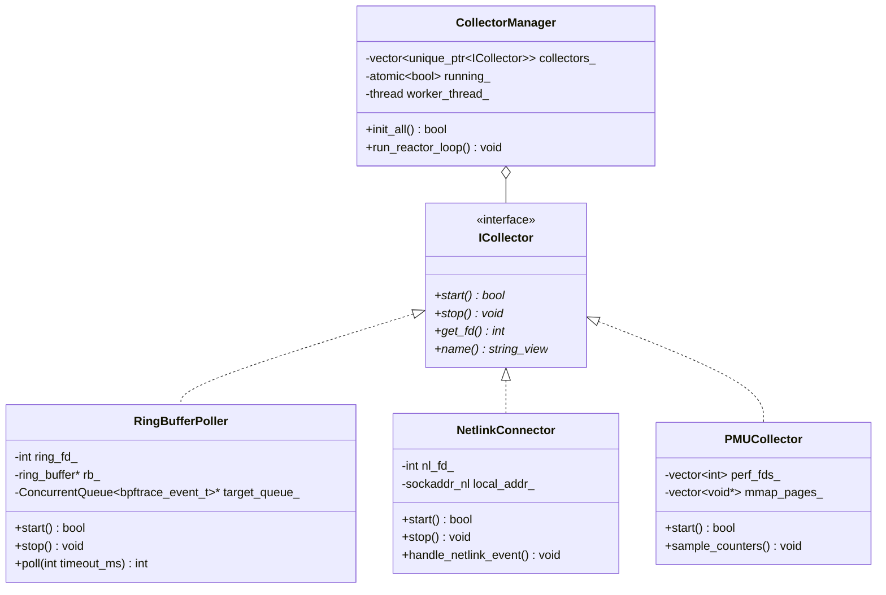

> **Historical documentation notice**
>
> This document describes the retired C++ implementation. It is retained for historical reference only. It is not valid for the current Rust application. Use the current [documentation index](../README.md), [project README](../../README.md), and [architecture guide](../../ARCHITECTURE.md) for build, configuration, deployment, and behavior.

# VOLUME 3: EDGE DAEMON ARCHITECTURE & COMPLETE C++ CLASS CATALOG

---

## 3.1 Executive Edge Daemon Class Map

The edge daemon (`syspilotd`) is organized into modular C++20 components with strict separation of responsibilities.



---

## 3.2 Exhaustive C++ Class Specifications

### 3.2.1 `ICollector` Interface Header Specification
```cpp
namespace syspilot::collector {

class ICollector {
public:
    virtual ~ICollector() = default;

    // Initializes underlying hardware sockets or eBPF maps
    virtual bool start() = 0;

    // Unbinds probes and shuts down underlying descriptors
    virtual void stop() = 0;

    // Returns file descriptor for integration into epoll reactor loop (-1 if poll-free)
    virtual int get_fd() const noexcept = 0;

    // Returns human-readable collector identifier
    virtual std::string_view name() const noexcept = 0;
};

} // namespace syspilot::collector
```

### 3.2.2 `RingBufferPoller` Implementation Specification
```cpp
namespace syspilot::collector {

class alignas(64) RingBufferPoller final : public ICollector {
private:
    int                                        ring_fd_{-1};
    struct ring_buffer*                        rb_{nullptr};
    moodycamel::ConcurrentQueue<bpftrace_event_t>* target_queue_{nullptr};
    std::atomic<uint64_t>                      events_polled_{0};
    std::atomic<uint64_t>                      events_dropped_{0};

public:
    explicit RingBufferPoller(moodycamel::ConcurrentQueue<bpftrace_event_t>* queue);
    ~RingBufferPoller() override;

    bool start() override;
    void stop() override;
    int get_fd() const noexcept override { return ring_fd_; }
    std::string_view name() const noexcept override { return "RingBufferPoller"; }

    int poll(int timeout_ms) noexcept;
    uint64_t total_polled() const noexcept { return events_polled_.load(std::memory_order_relaxed); }
};

} // namespace syspilot::collector
```
